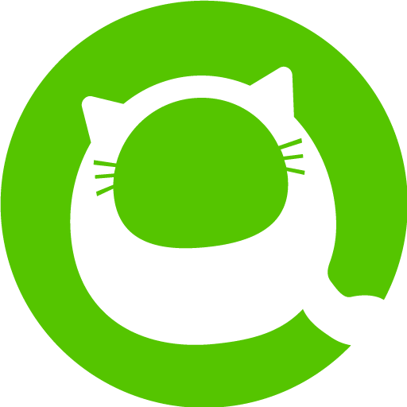

## 🐞 About Me

Web アプリを作るお仕事をしています。ときどき小中高生ともプログラミングします。

## 👨‍💻 Most Used Languages

##  Latest Blog Posts

<!-- BLOG-POST-LIST:START -->
- [【AWS SAM × Agentic Cording】推してるバンドの新着ニュースをメール通知して、&quot;遠く知らない街から手紙が届くようなときめきを作れたらな&quot; 🐟](https://qiita.com/kamata-bug-factory/items/65609bca7fceee7531c4)
- [【Mac】Docker Desktop を使わずに Docker をインストールする](https://qiita.com/kamata-bug-factory/items/f3b669ab113fd5c91115)
- [開発コンテナ内から git push したい！](https://qiita.com/kamata-bug-factory/items/65c34fdc9ad898cf5d60)
- [プログラミングで広がる学び](https://qiita.com/kamata-bug-factory/items/74d34888507dfaab2d0f)
<!-- BLOG-POST-LIST:END -->

<!--
**kamata-bug-factory/kamata-bug-factory** is a ✨ _special_ ✨ repository because its `README.md` (this file) appears on your GitHub profile.

Here are some ideas to get you started:

- 🔭 I’m currently working on ...
- 🌱 I’m currently learning ...
- 👯 I’m looking to collaborate on ...
- 🤔 I’m looking for help with ...
- 💬 Ask me about ...
- 📫 How to reach me: ...
- 😄 Pronouns: ...
- ⚡ Fun fact: ...
-->
